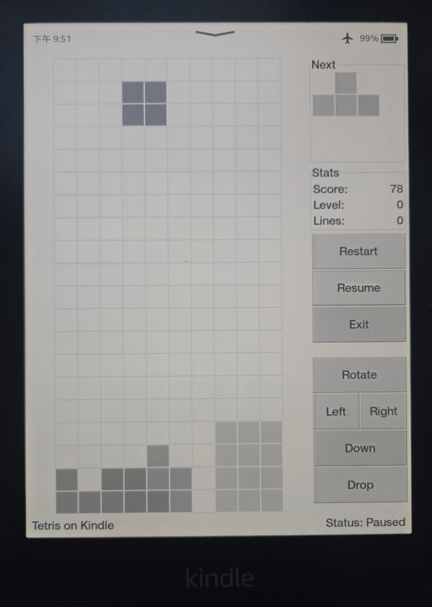

# Kindle Tetris
Tetris clone written in C++ & GTK 2.0 for Amazon Kindle PW4+ (kindlehf).



## Features
- 🎮 Classic Gameplay: Full implementation of core Tetris mechanics.
- 📱 Kindle Optimized: Built with GTK 2.0 and Cairo for efficient rendering on e-ink displays.
- 🖥️ Modern UI: Features a clean board layout, next-piece preview.
- ⌨️ Flexible Controls: Supports both on-screen touch controls and physical keyboard input.
- 📐 Responsive Design: Automatically scales layout to fit the screen.


## Install

- Install [WinterBreak JB](https://kindlemodding.org/jailbreaking/WinterBreak/)
- Install [KUAL](https://kindlemodding.org/jailbreaking/post-jailbreak/installing-kual-mrpi/)
- Download the game from the [latest releases](https://github.com/shichen35/kindle-tetris/releases)
- Unzip the archive and move the `tetris` directory to `extensions` on Kindle
- Run the game (KUAL -> Tetris)

## Build

### PC (native)
```
meson setup build_pc
ninja -C build_pc
./build_pc/tetris
```

### Kindle / cross-compile
1. Install [Kindle SDK prerequisites](https://kindlemodding.org/kindle-dev/gtk-tutorial/prerequisites.html)
2. Configure paths inside `build_kindlehf.sh` if needed
3. Run `./build_kindlehf.sh`
4. Output is the `tetris` directory (bin + KUAL config), ready to use.

## Reference
- https://github.com/xfangfang/gtktetris_kindle
- https://github.com/wader/gtktetris
