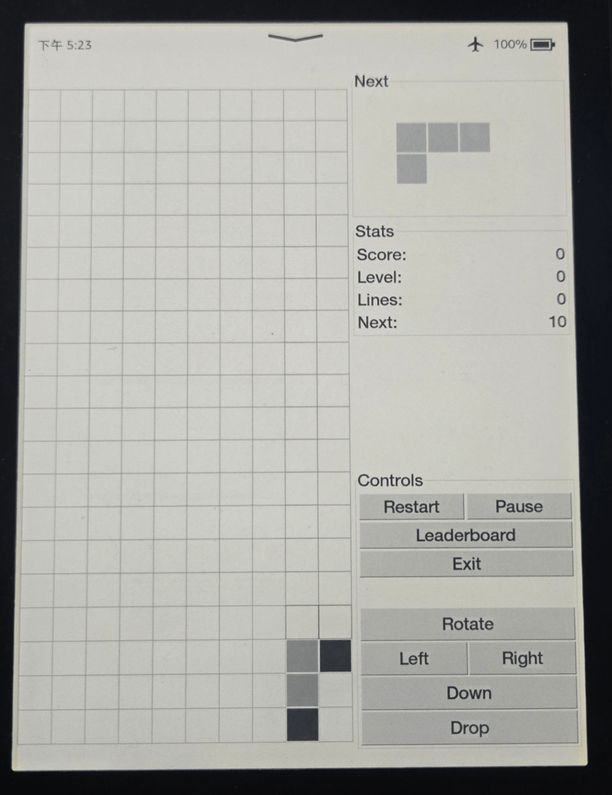
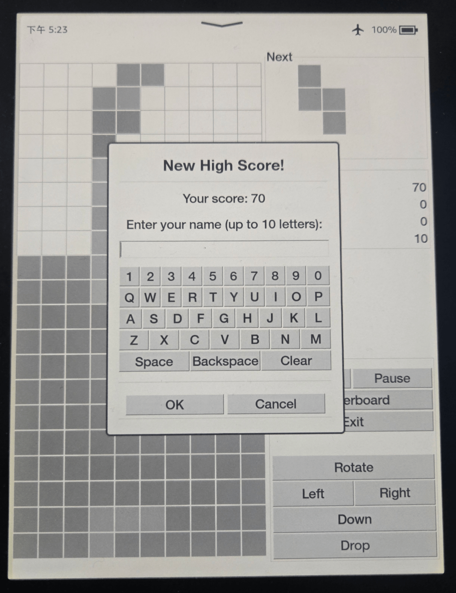
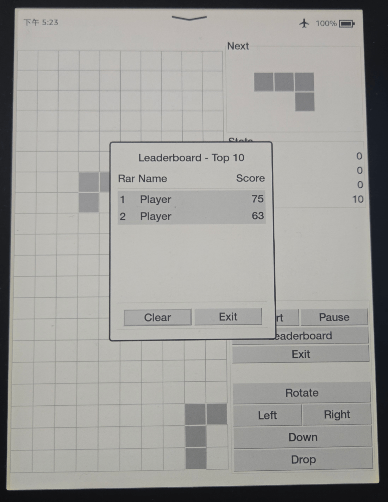

# Kindle Tetris
Tetris clone written in C++ & GTK 2.0 for Amazon Kindle PW4+ (kindlehf).

## Features
- Classic Gameplay: Full implementation of core Tetris mechanics.
- Kindle Optimized: Built with GTK 2.0 and Cairo for efficient rendering on e-ink displays.
- UI: Clean board layout with next-piece preview.
- Controls: On-screen touch controls and physical keyboard input.
- Leaderboard: Persistent top 10 scores, with a name entry dialog for new high scores.
- Stable Layout: Eliminates grid shaking caused by button resizing.
- Leveling: Exponential progression with r = 1.4 (clamped to level 19), which increases fall speed.

## Release notes
### Since first release
- Added leaderboard and high score recording dialogs.
- Fixed grid shaking caused by dynamic button resizing.
- Updated leveling formula: exponential progression using L(n) = ceil(10 * r^(n - 1)) with r = 1.4.

## Install
- Install [WinterBreak JB](https://kindlemodding.org/jailbreaking/WinterBreak/)
- Install [KUAL](https://kindlemodding.org/jailbreaking/post-jailbreak/installing-kual-mrpi/)
- Download the game from the [latest releases](https://github.com/shichen35/kindle-tetris/releases)
- Unzip the archive and move the `tetris` directory to `extensions` on Kindle
- Run the game (KUAL -> Tetris)

## Build

### PC (native)
```
meson setup build_pc
ninja -C build_pc
./build_pc/tetris
```

### Kindle / cross-compile
1. Install [Kindle SDK prerequisites](https://kindlemodding.org/kindle-dev/gtk-tutorial/prerequisites.html)
2. Configure paths inside `build_kindlehf.sh` if needed
3. Run `./build_kindlehf.sh`
4. Output is the `tetris` directory (bin + KUAL config), ready to use.

## Screenshots




## Reference
- https://github.com/xfangfang/gtktetris_kindle
- https://github.com/wader/gtktetris
